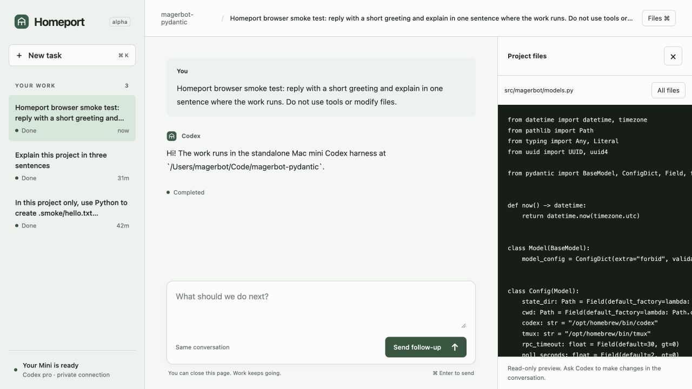

# Homeport

**A home for coding work that keeps running when you leave.**

Start a task from your laptop. Check its progress from your phone. Come back to the same conversation, with your files and Codex still on your own computer.

Homeport is a small Python/Pydantic workspace around Codex CLI's app-server. It has a private browser interface, durable task records, and an optional interactive Codex terminal. Pydantic validates the data; Codex does the coding. There is no second model loop or Pydantic AI dependency. Model inference still goes through OpenAI; the agent processes, repositories, and task state live on your computer.



## What works

- Submit tasks, observe progress, read results, and continue a conversation.
- Review project files and command output in the browser.
- Close the browser or disconnect SSH while work continues.
- Use the browser and Codex TUI with the same live conversation.
- Recover after a Python worker restart without replaying acknowledged work.
- Reach the interface privately through Tailscale, using normal Codex authentication.

This is an early personal-tool release, tested on an Apple Silicon Mac mini with Codex CLI 0.160.0. [Verified behavior and limits](docs/verification.md).

## Install on the Mini

Requires macOS, Homebrew, Git, and a Codex-supported ChatGPT account.

```sh
brew install tmux uv
brew install --cask codex
codex login --device-auth

git clone https://github.com/mager/homeport.git
cd homeport
uv python install 3.12
./scripts/install-mini.sh
```

The installer creates a virtual environment and a user LaunchAgent. A dedicated tmux session runs the Codex server, Python worker, and web service. To open it directly on that computer, visit `http://127.0.0.1:8787`.

**Permission model:** this version intentionally uses `danger-full-access` and approval policy `never`. Tasks execute with the signed-in macOS user's filesystem and network access. This does not grant root or bypass macOS privacy controls. Use a machine/account where you intend to give Codex that access.

## Open from your laptop or phone

Sign into Tailscale on both devices and the Mini, then run this **on the Mini**:

```sh
cd ~/Code/homeport  # or your checkout location
.venv/bin/python scripts/share-tailnet.py
```

The script configures private HTTPS on port 9443 and prints the URL plus the command to reload the web service's access settings. It refuses to overwrite an unrelated service on that port. It never enables Tailscale Funnel.

Open the printed URL and bookmark it. The app accepts the Tailscale identity of the Mini's owner. Other tailnet users are rejected. Codex credentials remain on the Mini, managed by Codex.

1. Choose **New task** and describe the work.
2. Set the project folder on the Mini when needed.
3. Leave the page. Return to read the result or send a follow-up.
4. Open **Files** to review the code. Ask Codex for edits in the conversation.

No terminal attachment is required. The phone must have an active Tailscale connection. This is a responsive web interface, not a native phone app.

## Optional: use the CLI too

On the Mini:

```sh
homeport submit 'Explain this project in three sentences'
homeport list
homeport events TASK_UUID --follow
homeport result TASK_UUID
homeport tui TASK_UUID
```

The last command opens that conversation in a Codex TUI connected to Homeport's app-server. From your laptop:

```sh
ssh -t YOUR_MINI 'tmux -L magerbot attach -t magerbot'
```

Detach with **Ctrl-b**, then **d**. The legacy tmux/state name `magerbot` and the `magerbot` command remain for compatibility with the first installation; the product and repository are Homeport.

To resume through Python: `homeport submit --thread THREAD_UUID 'Continue from our last result'`.

## How it fits together

```text
Laptop or phone browser
       │ private HTTPS through Tailscale Serve
       ▼
Homeport web app ── SQLite task queue ── Python worker
                                            │ JSON-RPC / Unix socket
                                            ▼
                                     Codex app-server
                                            ▲
                                            │ same live conversation
                                     Optional Codex TUI
```

The web app listens only on `127.0.0.1:8787`. Tailscale Serve supplies the private HTTPS endpoint and verified identity headers. Host and Origin validation protect the local interface from cross-site requests. There are no cloud API keys or browser-held Codex tokens.

The file viewer stays within the selected project, excludes hidden paths and symlinks escaping it, and caps file size. Those viewer restrictions are separate from Codex's intentionally full-access execution policy.

## Persistence and uncertain outcomes

Task IDs, thread IDs, turn IDs, structured events, and final results live in SQLite at `~/.local/state/magerbot/tasks.sqlite3`. Configuration is `~/.config/magerbot/config.json`; private web settings are `~/.local/state/magerbot/web.json`. Codex owns its normal `~/.codex` authentication and thread storage.

- A submission ID is saved before dispatch. Browser retries reuse it.
- After a worker restart, known turns are observed again, never resubmitted.
- An ambiguous submission becomes `uncertain` and blocks further work on that thread.
- `homeport inspect TASK_UUID` reads the saved conversation.
- `homeport reconcile TASK_UUID` retrieves a known turn's result. If an uncertain task lacks a turn ID, inspect first and explicitly bind it with `--turn TURN_ID`.
- A task deadline requests interruption. It cannot undo tools that already ran.

For scripts over unreliable SSH, generate a UUID and pass `homeport submit --id UUID 'task'`. Reuse that ID and identical input after a lost response.

## Disconnects versus reboots

Closing your browser, losing SSH, or closing your laptop does not stop the processes on the Mini. Launchd restores the server, worker, and web panes after a crash. It does not replay uncertain tasks.

The LaunchAgent starts at the user's macOS login after a reboot. It is not an unattended boot daemon. FileVault may require local unlocking. Keep the Mini awake for continuous work.

Inspect supervision with `launchctl print gui/$(id -u)/com.magerbot.harness`. To stop it, run `launchctl bootout gui/$(id -u)/com.magerbot.harness`, then, once work is finished, `tmux -L magerbot kill-server`. Re-run the installer to re-enable supervision.

## Development

```sh
uv sync --locked
uv run pytest -q
uv run homeport web
```

The frontend is plain HTML/CSS/JavaScript served by FastAPI. There is no frontend build step. Personality and project boundaries live in [AGENTS.md](AGENTS.md).

This personal installation excludes Perch and magerblog as task working directories. Adjust those explicit exclusions if adapting Homeport for a different owner. They are instruction and input-validation boundaries, not an OS sandbox.

[Protocol](https://learn.chatgpt.com/docs/app-server) · [Codex authentication](https://learn.chatgpt.com/docs/auth) · [Tailscale Serve](https://tailscale.com/docs/features/tailscale-serve) · [MIT license](LICENSE)
